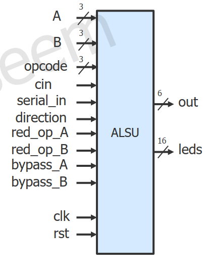
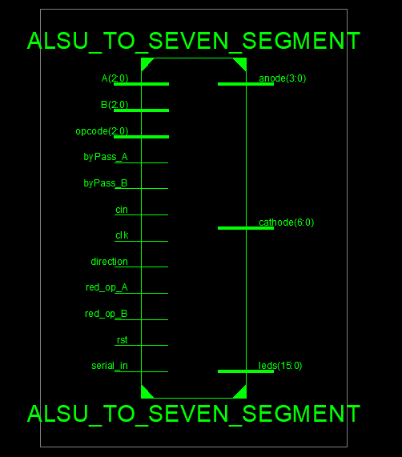
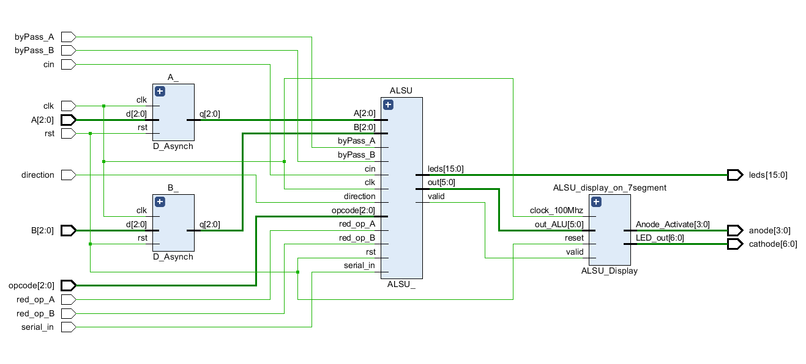
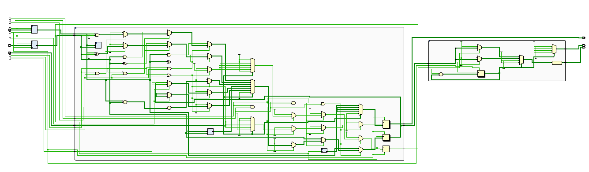

# ALSU_project
this project mainly focus on design and implementation for Arithmetic Logic Shift Unit using Verilog HDL to descripe it.

 *Top Module*

#Block Diagram
 *Top Module*

##Schematic Design 
 *Schematic*

##NetList 
 *NetList*
